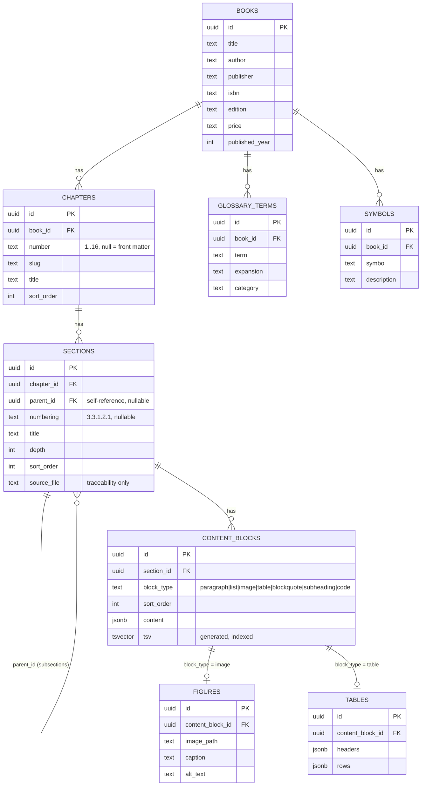

# Loony Library — ER Diagram

Entity-relationship diagram for the schema described in [app_idea.md](./app_idea.md) and implemented in [migration/schema.sql](../migration/schema.sql).

## Reading the diagram

- **BOOKS → CHAPTERS → SECTIONS** is the outline. `SECTIONS` self-references via `parent_id` because the source numbering nests arbitrarily deep (e.g. `1.5.4.1.1.1`); `depth` is derived from the dot-count in `numbering`, not from the markdown `#` level, since the source markdown is inconsistent about heading levels.
- **SECTIONS → CONTENT_BLOCKS** is the actual renderable content: one row per paragraph, list, image, table, blockquote, code block, or subheading, in `sort_order`. `subheading` exists for markdown headings in the source that aren't real document sections (glossed labels, worked-example lead-ins) — they render in place on the page instead of becoming their own navigable `sections` row.
- **CONTENT_BLOCKS → FIGURES / TABLES** are 1:0..1 side tables that only exist for blocks of the matching `block_type`, holding the structured data (image path + caption, or table headers/rows) instead of overloading `content_blocks.content` with every shape.
- **GLOSSARY_TERMS** and **SYMBOLS** hang off `BOOKS` directly rather than the outline, since they're book-level reference lists (Abbreviations, Conventional Symbols and Suprasegmentals), not sections of prose.
- Full-text search runs on `content_blocks.tsv`, a generated `tsvector` column indexed with GIN — no separate search table needed at this scale (~1,400 content blocks).
